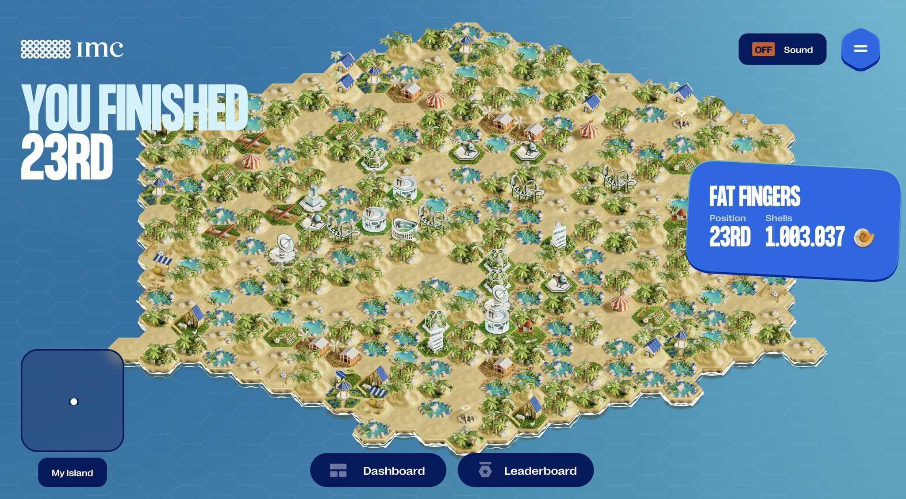

# Fat Fingers 👆

Welcome to the GitHub repository of **Fat Fingers**, our team for the **IMC Prosperity 3 (2025)** algorithmic trading competition.

We are a group of **5 French Financial Engineering and Applied Mathematics students from CY Tech**.  
We placed:  
**1st in France** 🇫🇷  
**6th in Europe** 🇪🇺  
**23rd globally** 🌍

---

## the competition

**IMC Prosperity 3 – 2025** is an algorithmic trading competition that lasted over 15 days, with over **12,000 teams participating globally**.

In the challenge, we were tasked with **algorithmically trading various products**. The trading environment mimicked real markets, and we competed against **bots whose behavior could be inferred from historical data**.

At the end of each round, our algorithm was evaluated independently, and the resulting PnL ranked against all other teams.

In addition to the main algorithmic focus, there were also **manual trading mini-games**. These varied in nature and accounted for a small portion of total profit.

Documentation: [Prosperity 3 Wiki](https://imc-prosperity.notion.site/Prosperity-3-Wiki-19ee8453a09380529731c4e6fb697ea4)

---

## the team

We proudly represented **CY Tech, France** with a shared love for quant finance, data science, and algorithmic design.

| Name | LinkedIn |
|------|----------|
| **Marwan Ferreira da Silva** | [Link](https://www.linkedin.com/in/marwan-ferreira-da-silva/) |
| **Julien Ruiz**              | [Link](https://www.linkedin.com/in/julien-ruiz75/) |
| **Dorian Beurthe**           | [Link](https://www.linkedin.com/in/dorian-beurthe-4a9a772b3/) |
| **Justin Léon**              | [Link](https://www.linkedin.com/in/justin-l%C3%A9on/) |
| **Gabriel Tran-Phat**        | [Link](https://www.linkedin.com/in/gabriel-tran-phat-751477317/) |

---

## Strategy Evolution Across Rounds

### Round 1: *Amethysts & Starfruit*

- **49,762 seashells**
- **1705th out of 10,000+ teams**
- **1467th in manual trading**
- **58th in France**

**Strategy:**  
We implemented a fair-value market making model, relying on constant mid-prices (for amethysts) and rolling average mid estimation (for starfruit). We adjusted our edge dynamically and handled inventory risk by flattening positions using 0 EV trades when available.

---

### Round 2: *CROISSANTS, BASKETS, and Multi-Product Arbitrage*

- **78,348 seashells**
- **937th place overall**
- **291st in manual trading**
- **38th in France**

**Strategy:**
- EMA + recent mean hybrid fair value
- Volatility-aware spreads
- Confidence-scaled order sizes
- Basket arbitrage on PICNIC_BASKET1 and PICNIC_BASKET2
- Momentum filtering to avoid fading strong directional moves
- Strict position limit management

We refined our strategy using live backtests and market simulations, focusing on capitalizing on temporary inefficiencies between components and their baskets. Our manual trading also improved significantly in this round.

---

### Round 3: *Options, Delta Hedging & Regime-Switching Alpha*

- **482,195 seashells**
- **42nd place worldwide**
- **1st in France**
- **96th in manual trading**

**Strategy:**

In Round 3, we extended our multi-product trading engine by integrating options pricing, live delta hedging, and regime-adaptive behaviors, resulting in a major boost in PnL and global ranking.

**Core Components:**
- Black-Scholes options pricing for theoretical valuation
- Delta hedging using the underlying asset with frequent rebalancing
- Regime switching based on real-time volatility and momentum:
  - Mean-reversion strategies in low-vol regimes
  - Trend-following logic in directional markets
- Hybrid fair value estimation combining EMA, short-term mean, and microstructure-aware adjustments
- Confidence-weighted order sizing based on signal strength and market regime
- Basket arbitrage on PICNIC_BASKET1 and PICNIC_BASKET2 using synthetic component value models
- Capital protection and drawdown control through rolling position limits and live PnL risk checks

**Engineering Refinements:**
- Modular, event-driven architecture for handling bursts with minimal latency
- Rebuilt trade/message parsers for cleaner state management
- Clear separation between valuation, signal generation, and execution logic
- Stress-tested in multiple backtest environments: high-volatility, skewed pricing, and synthetic imbalance scenarios

---

### Round 4: *Macarons, Vouchers & Everything in Between*

- **767,030 seashells**
- **19th place worldwide**
- **1st in France**
- **486th in manual trading**

**Strategy:**

In Round 4, we pushed our trading engine to its limits — both literally and algorithmically — by building a comprehensive multi-asset framework that handled options, baskets, and conversions in a unified and data-driven way.

We started by discarding unprofitable assets like MAGNIFICENT_MACARONS as standalone products and used them solely as conversion bridges. This unlocked better arbitrage flows across more reliable instruments.

**Core Components:**
- Hybrid fair value estimation (EMA + rolling mean) for dynamic valuation
- Volatility and momentum detection to classify regimes and adapt spreads
- Multi-level market making with confidence-adjusted order sizing
- PICNIC_BASKET1 & BASKET2 arbitrage using synthetic value reconstruction
- Voucher pricing using Black-Scholes, paired with:
  - Delta hedging using VOLCANIC_ROCK
  - Time-to-expiry decay modeling
- Stop-loss and trailing exit logic for adverse momentum regimes
- Capital preservation via rolling average cost tracking and dynamic spread widening

**Key Decisions:**
- Fully disabled breakout trading and high-risk speculation
- Focused on stable, scalable alpha across well-understood edges
- Switched off MACARONS trading after early backtest PnLs showed consistent loss
- Centralized signal logic and reduced hardcoding — favoring dynamic estimators over assumptions

---

## tools & tech

We used a full suite of testing and visualization tools to build, debug, and optimize our strategies:

- [Prosperity 3 Wiki](https://imc-prosperity.notion.site/Prosperity-3-Wiki-19ee8453a09380529731c4e6fb697ea4)
- [JMerle’s Backtester](https://github.com/jmerle/imc-prosperity-3-backtester)
- [JMerle’s Visualizer](https://github.com/jmerle/imc-prosperity-3-visualizer)
- [JMerle’s Submitter](https://github.com/jmerle/imc-prosperity-3-submitter)
- [IMC Discord](https://discord.com/channels/1001852729725046804/1337359637128806490)

Huge thanks to [**@jmerle**](https://github.com/jmerle) for making his tools public and battle-tested. These made the IMC competition actually fun to engineer for.
